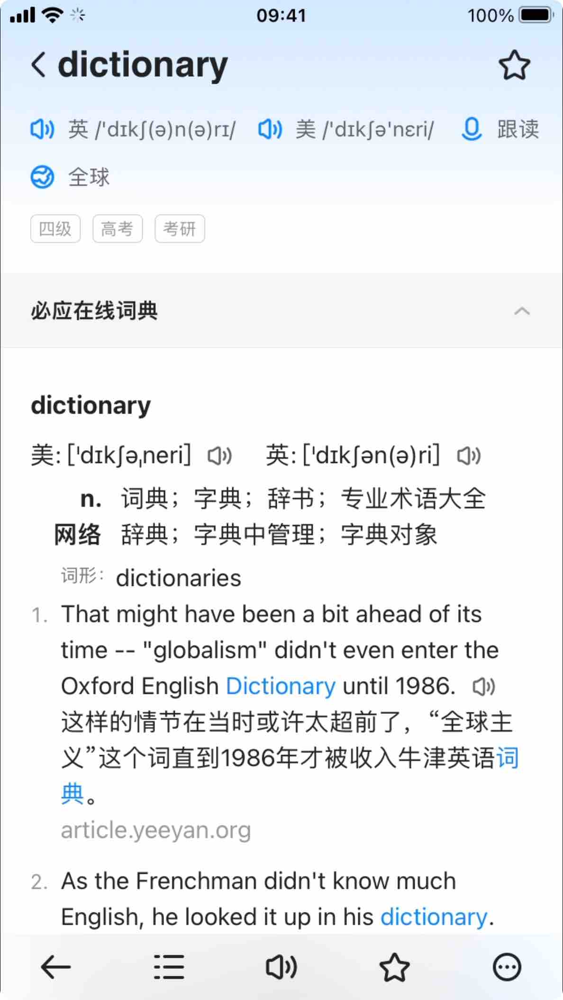

# Eudic-Online-Dict 欧路词典在线查词引擎

[【中文说明】](./README-zh.md)

## Pre-step

- The `Node` version requires >14
- Use `yarn` to install dependencies

## Debug dictionary

- `yarn fixtures` download some necessary HTML content
- `Yarn storybook` directly debugs the style in the mobile version of the Eudic interface
- Theme debugging: After running the storybook, click `Addons` and fill in the theme name of the topic you want to debug
- `eudic/main.css` contains Eudic inner css in order to simulate within the software

## Deploy to your Eudic

- `yarn build`
- Packaged dictionaries should be found in `dist`
- Copy dictionary folder into Eudic (by using the WIFI transfer function)
- Open `dictionary management` in Eudic, verify your dictionary is installed correctly

## Development a new dictionary

- Create a new folder at `src/dicts/[dictionary name]`
- Create dictionary config files: `eudic_config.json`, `index.ts`
- `index.ts` is the main plugin module 
- `pagefetch.ts` contains interpretive content download logic (`yarn fixtures` use this module to pre-download necessary resource)

## Coding Conventions

- Thesaurus plugin class name, which must be capitalized in the first letter, followed by all lowercase + `Plugin`. For example, `BingPlugin`
- If a dictionary contains multiple languages of translation, or multiple languages, then put the main parsing of the word base into `src/dicts/base` and name it in the form `Language2Language`, with the initials capitalized. For example, `JukuuEn2JpPlugin`; if it is just one-to-many, then it is named as a 'type'. For example, Macmillan has English and American accents, which is `macmillan_uk` and `macmillan_us`

## Known issues

- Javascript interaction within the dictionary, such as binding click events, is not supported at this time

## Special thanks

- [Saladict](https://github.com/crimx/ext-saladict)
